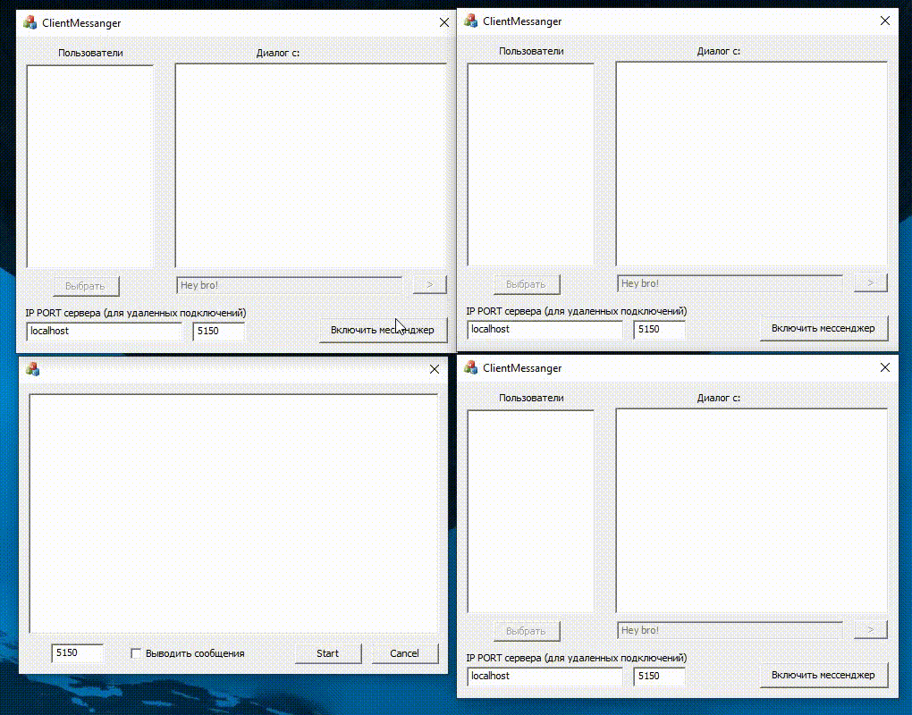

# MFC Client/Server Messanger

### Экзаменационная работа Молоткова Владислава ИВТ-32

## Описание Messanger

Необходимо быстро написать кому-то?

> Просто откройте приложение Messanger и напишите активным пользователям!

## Функциональная реализация

- [x] Автоматическое обновление списка пользователей
- [x] Автоматическое определение себя в списке пользователей
- [x] **История сообщений** (без закрытия клиента)
- [x] Возможность написать любому активному пользователю
- [x] Отображение о непрочитанном сообщении в списке пользователей (знак \*)
- [x] Возможность общаться на отдельном порту
- [x] Возможность общаться между разными ПК в локальной сети
  - [x] !Необходимо разрешить Windows Брендмауер доступ к частной сети
  - [x] !Необходимо знать ip вашего собеседника и попросить его включить сервер у себя на ПК

## Описание разработки приложения

При создании приложения **Messanger** я использовал:

- [x] Библиотеку MFC
- [x] TCP-протокол
- [x] Модель EventSelect, т.к. посчитал её самой удобной из-за активации только после какого-то события на сокете

## Параметры передачи данных между клиент-сервер

Так как это приложение использует клиент-серверную модель общения, то расскажу немного про то, как же общаются клиент и сервер (какими параметрами).

При первом подключении клиента к серверу (и установки соединения с сокетом) отсылается сообщение на связанный сокет серверу

> `connect=user`
>
> - connect - команда для сервера
> - user - номер сокета, индентифицирующего пользователя

После принятия сообщения, сервер обрабатывает это сообщение и формирует новую строку, которую отправляет всем активным сокетам, на которые установлены слушатели со стороны клиентов

> `users=xxx&yyy&zzz&...`
>
> - users - команда для клиента
> - xxx, yyy, zzz ... - номер сокета, индентифицирующего пользователя на сервере

Клиент получает данные и после парсинга (разбивания) этого сообщения уже добавляет пользователей в список (проверяя, есть ли данные такие пользователи в локальном хранилище, или удаляет, если данные расходятся).

При отправке сообщений между клиентами, клиент формирует строчку и отправляет на сервер

> `message=text&from&to`
>
> - message - команда для сервера
> - text - само сообщение клиента
> - from - от кого сообщение (номер сокета)
> - to - кому сообщение направлено (номер сокета)

После получения данных сервером, он их обрабатывает и посылает то же сообщение на сокет клиента, установленный в параметре **to**.
