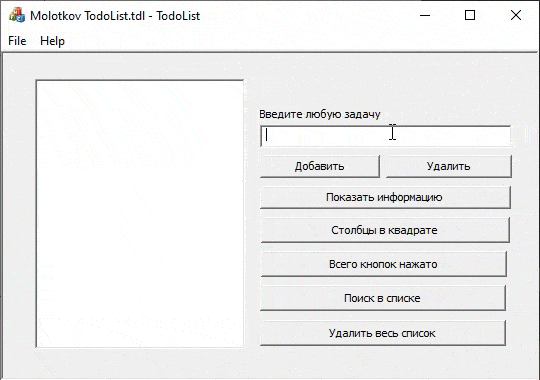

# MFC ToDoList 
### Зачетная работа Молоткова Владислава ИВТ-32

## Описание ToDoList
Приложение ToDoList поможет вам записывать все самое важное в одно действие!
> Просто откройте приложение и напишите задачу!

## Функциональная реализация
- [x] Добавление, удаление записей в **CListBox**
- [x] Просмотр информации о задаче
- [x] Просмотр количества столбов в квадрате
- [x] Просмотр количества нажатых кнопок
- [x] Удаление всех заданий, начинающихся сv произвольной строчки c помощью модального диалогового окна с полем
- [x] Навигация с помощью TAB
- [x] Настроены горячие клавиши:
- `Enter/Return` - добавление задачи
- `Delete` - удаление задачи
- `CTRL + NUMPAD1` - просмотр информации о задаче
- `CTRL + NUMPAD2` - просмотр столбцов в квадрате
- `CTRL + NUMPAD3` - просмотр количества нажатых кнопок
- `CTRL + NUMPAD4` - открытие диалогового окна с инпутом для удаления задач, начинающихся с заданной строчки
- `CTRL + Delete` - удаление всех задач
- [ ] Сохранение, открытие документа (не смог реализовать сериализацию CListBox)

## Комментарии к сериализации
Мои попытка сделать сериализацию завершились неудачей, и я создал новую ветку с багом [Не рабочая сериализация](https://github.com/MaseDar/cpp-unic/tree/ToDoList-bugs), чтобы попытать счастье на помощь :smile:

**ОПИСАНИЕ ПРОБЛЕМЫ В КОНЦЕ README.md**

### СПАСИБО ЗАРАНЕЕ!
